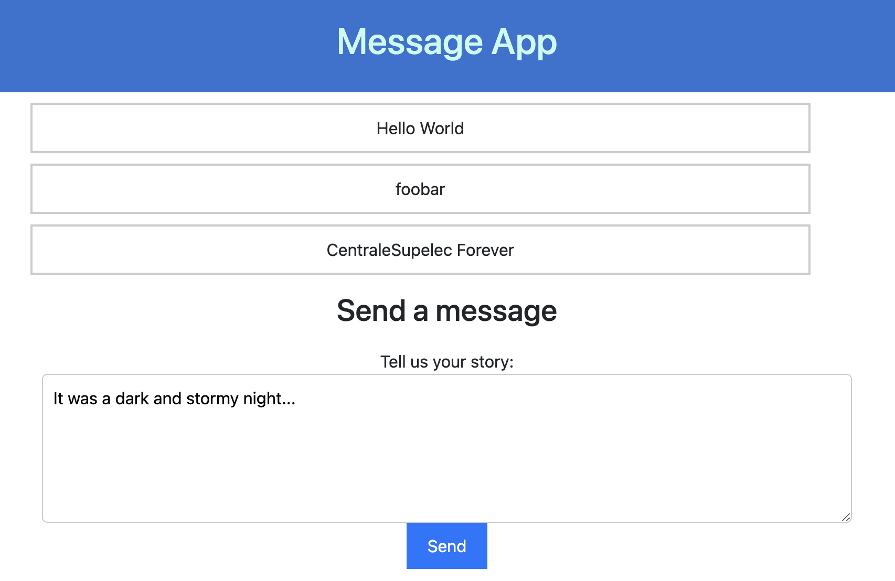
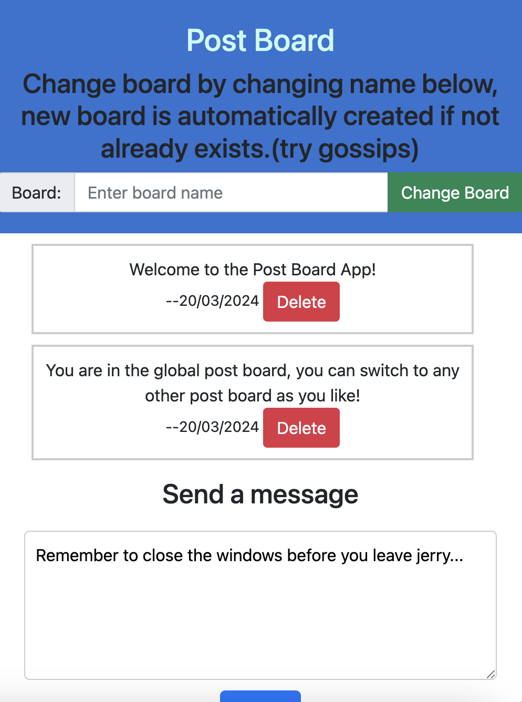
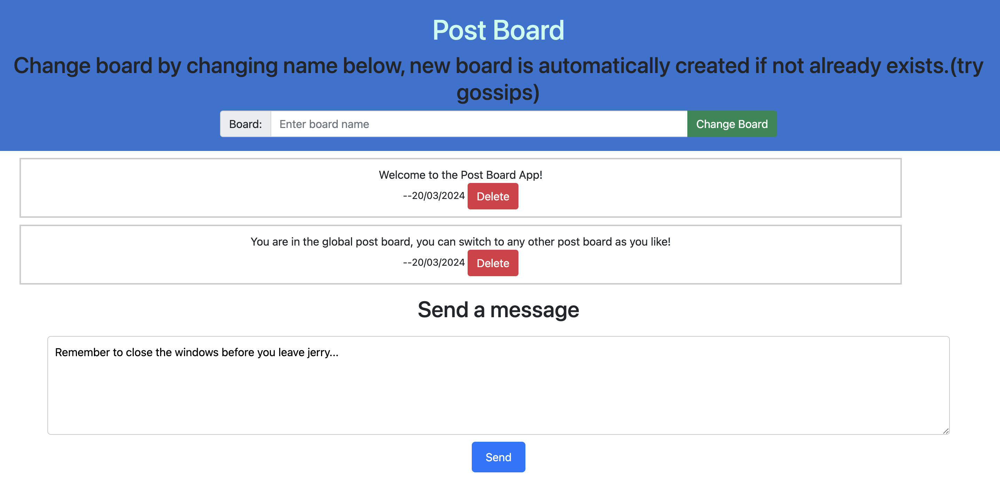

# Archi-App Web Project Report


## Frontend
We've kept a copy of the version of our message app without the backend in `client/message-app.html`. 

### Deployment

The application can be assessed through the link below:
`https://archiapp-front.onrender.com/message-app.html`



### Design and functioning of the application
This is a simple message app that follows strictly what's asked in the lab. There is no backend involved in this part of
the project. 

We have a `li` list of `ul` elements that are messages populated using javascript:
```html
<ul id="message-list">
<!--    list elements here-->
</ul>
```

We store all our messages in a javascript variable `globalMessages`:
```javascript
globalMessages = [
    {"msg": "Hello World"},
    {"msg": "Blah Blah"},
    {"msg": "I love cats"}
];
```

We append a new elements to this globalMessages variable whenever a new messages is added. And we re-populate the list
with the messages stored in `globalMessages`. Relevant code:
```javascript
const li = document.createElement('li');
li.className = "message-body";
li.appendChild(document.createTextNode(msg.msg));
messageList.appendChild(li);
```

After the DOM Tree is uploaded, we make a best-effort attempt at sending the message to the server. This can fail and make the user
have inconsistent content on the browser, but is addressed in the final app (see section about final app).

Note that we could have compared the messages in the DOM tree and the messages in the globalMessages and only update what's needed (i.e. here only append a new `ul`).
We've decided not to do so because the performance gain is not noticeable for our application, and this would make some fo the 
logics in Part III more difficult (like deleting messages).

---
## Backend

### Deployment:
URL of the backend: `https://archiapp.onrender.com`

### Functioning

Since we're just simply following what's demanded in the instructions, so there isn't really much interesting to describe here. 
In `server` folder we can find the node.js backend code of our website. The code is separated into three "sub-apps": 

- `server/apps/basics`: exports the (Express) router for routes of `2.1 Configuration`
- `server/apps/counter`: exports the router for routes for routes relating to the counter micro-service
- `server/apps/messages`: corresponds to the router of our first version message app

Since we're just following the instructions, there isn't much to talk about without getting into the nitty-gritties of the details that are
irrelevant for the evaluation of the project. Here is a list of manual tests that we have done for the application, as 
well as the results to show what implemented.


### GET /json/string

```json
Hello, World!
```

### GET /json/object

```json
{
  "a": 1,
  "b": 2
}
```

### GET /json/array

```json
[
  "Hello",
  "World",
  "!"
]
```

### GET "/test/Blah"

```json
{
  "msg": "blah"
}
```

## Relating to counter

### GET /cpt/query

```json
{
  "code": 0,
  "message": "Current count is 0"
}
```

### GET /cpt/query?v=5

```json
{
  "code": 0,
  "message": "Successfully incremented to 5"
}
```

### GET /cpt/query?v=whatsup

```json
{
  "code": -1,
  "error": "Value is not an integer"
}
```

### GET /cpt/inc

```json
{
  "code": 0,
  "message": "Successfully incremented to 6"
}
```

## Relating to messages

### GET /msg/nber

```json
3
```

### GET /msg/getAll

```json
[
  "Hello World",
  "foobar",
  "CentraleSupelec Forever"
]
```

### GET /msg/post/你好,世界!

The uuid is returned:

```json
30763d62-5793-4211-b5bb-e073674beb14
```

### GET /msg/getAll

```json
[
  "Hello World",
  "foobar",
  "CentraleSupelec Forever",
  "你好,世界!"
]
```

### GET /msg/get/30763d62-5793-4211-b5bb-e073674beb14

```json
{
  "code": 1,
  "message": "你好,世界!"
}
```

### GET /msg/del/30763d62-5793-4211-b5bb-e073674beb14

```json
{
  "code": 0,
  "message": "Message deleted"
}
```

## The Final App, Post Board

### Deployment
The final application is deployed here:
```https://archiapp-front.onrender.com/post-board.html```.

The frontend html is found at `client/post-board.html`

Its backend is the same instance as the one used previously.

The router that handles the routes corresponding to the final app can be found in the `server/apps/post-board`


### Screenshots:

**On Portable Device:**:

(The div in the middle with the text area and the button becomes 100vw wide):




**On Wide Screen**:



### Design and functioning:

The concept of the app is that we have a shared post board. When you enter the application.
By default, you are on the `global` post board. Two boards are pre-populated with messages for demonstration purposes: `global` and `gossips`

- you can go to a new board by typing the name of the board, and clicking on "change board"
- the notes on the post boards are anonymous, and the only information kept about the user is the date
- when the user tries to enter a board that does not exits yet, a new board is created

### Structure of the project
Since all of the sub-apps of the project share the same backend, we've decided to split the project into sub-modules to help with the clarity of the structure.

#### client
The [client](./client) folder contains the static assets for the frontend. [client/message-app.html](./client/message-app.html) being for example the html page fo the first message app, and [client/post-board.html](./client/post-board.html) being the html page of the final post-board app.

#### server
The [server](./server) folder contains the backend code for our express app. 

[server/index.js](./server/index.js) sets up CORS headers, middleware for parsing user requests' bodies, imports routers 
from the [server/apps](./server/apps) folder and runs the Node.js backend. 

In [server/apps/post-board](./server/apps/post-board) can be found three files:
- `database.js` is the mock database for the post board app. It contains the logic for adding, deleting and querying messages from the database. We've decided to encapsulate
the database logic in a separate file to make the code more modular and easier to read.
- `handlers.js` contains the handlers for the routes of the post board app. It uses the database.js file to interact with the database, and its main
responsibility is to send the correct response to the user.
- `index.js` exports the router for the post board app. It defines the routes of the post board app and uses the handlers from `handlers.js` to handle the requests.

We have tried to make the code pretty self-explanatory in its structure, in the naming of the functions (for example,
we didn't find it necessary to add any comment to explain what the function `handleGetNoteById` does), and we've added
comments where necessary. 


